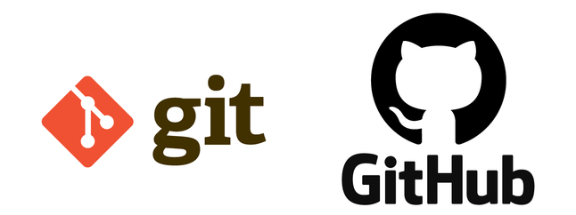
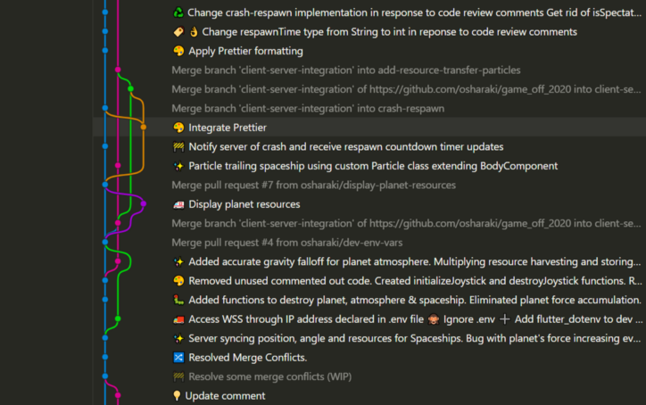
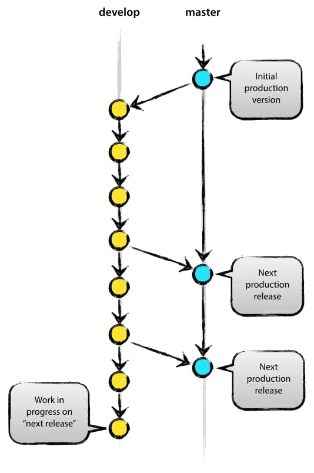
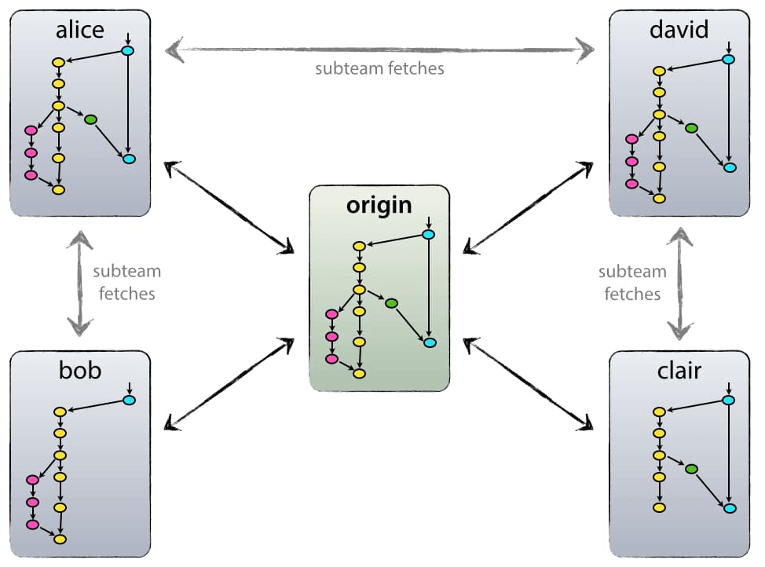
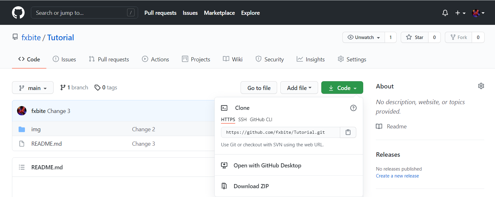
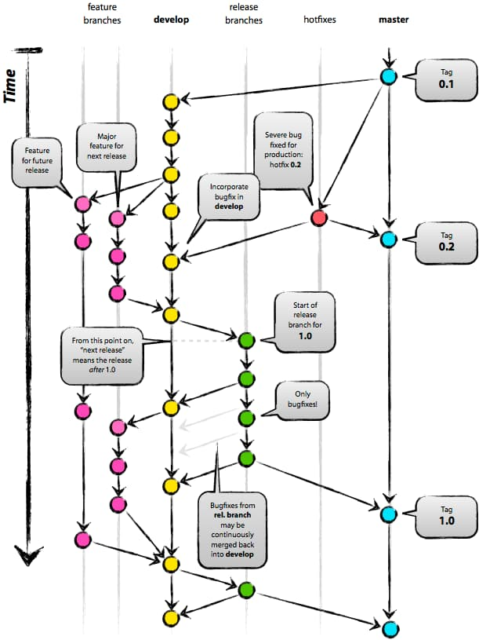

    
    <h2>Vai trò của Git và Github đối với một developer. Hướng dẫn cách sử dụng Git và Github.
    </h2>
    

        
        
        
    

<h2>Table of content</h2>
<ul>
<li>
<li>
<li>
</ul> 

<h2>Git là gì?</h2>

<code>Git</code> là một hệ thống quản lý phiên bản phân tán <strong>(Distributed Version Control System – DVCS)</strong>, nó là một trong những hệ thống quản lý phiên bản phân tán phổ biến nhất hiện nay. <strong>Git</strong> cung cấp cho mỗi lập trình viên kho lưu trữ (<strong>repository</strong>) riêng chứa toàn bộ lịch sử thay đổi.

<h2>Version Control System – VCS là gì?</h2>

VCS là viết tắt của <strong>Version Control System</strong> là <strong>hệ thống kiểm soát các phiên bản phân tán mã nguồn mở</strong>. Các VCS sẽ lưu trữ tất cả các file trong toàn bộ dự án và ghi lại toàn bộ lịch sử thay đổi của file. Mỗi sự thay đổi được lưu lại sẽ được và thành một version (phiên bản).

VCS nghĩa là hệ thống giúp lập trình viên có thể lưu trữ nhiều phiên bản khác nhau của một mã nguồn được nhân bản (<strong>clone</strong>) từ một kho chứa mã nguồn (<strong>repository</strong>), mỗi thay đổi vào mã nguồn trên local sẽ có thể ủy thác (<strong>commit</strong>) rồi đưa lên server nơi đặt kho chứa chính.

    

Và một máy tính khác nếu họ có quyền truy cập cũng có thể clone lại mã nguồn từ kho chứa hoặc clone lại một tập hợp các thay đổi mới nhất trên máy tính kia.

Lập trình viên có thể xem lại danh sách các sự thay đổi của file như xem một dòng thời gian của các phiên bản. Mỗi phiên bản bao gồm: nội dung file bị thay đổi, ngày giờ sửa đổi, người thay đổi là ai, lý do thay đổi hay tên phiên bản…

<h2 style="margin-top: 45px">Git có lợi ích gì?</h2>

Các dự án thực tế thường có nhiều lập trình viên làm việc song song. Vì vậy, một hệ thống kiểm soát phiên bản như Git là cần thiết để đảm bảo không có xung đột code giữa các lập trình viên.

Ngoài ra, các yêu cầu trong các dự án như vậy thay đổi thường xuyên. Vì vậy, một hệ thống kiểm soát phiên bản cho phép các nhà phát triển revert và quay lại phiên bản cũ hơn của code.

Cuối cùng, đôi khi một số dự án đang được chạy song song liên quan đến cùng một cơ sở code. Trong trường hợp như vậy, khái niệm phân nhánh trong Git là rất quan trọng.
<ul>
<li>Dễ sử dụng, thao tác nhanh, gọn, lẹ và rất an toàn.
<li>Sẽ dàng kết hợp các phân nhánh (branch), có thể giúp quy trình làm việc code theo nhóm đơn giản hơn rất nhiều.
<li>Chỉ cần clone mã nguồn từ kho chứa hoặc clone một phiên bản thay đổi nào đó từ kho chứa, hoặc một nhánh nào đó từ kho chứa là bạn có thể làm việc ở mọi lúc mọi nơi.
<li>Deployment sản phẩm của bạn một cách không thể nào dễ dàng hơn.
</ul>

<h2 style="margin-top: 45px">Các thuật ngữ Git quan trọng</h2>
<h3>1. Branch</h3>

Các <strong>Branch</strong> (nhánh) đại diện cho các <strong>phiên bản cụ thể</strong> của một kho lưu trữ tách ra từ project chính của bạn.

Branch cho phép bạn theo dõi các thay đổi thử nghiệm bạn thực hiện đối với kho lưu trữ và có thể hoàn nguyên về các phiên bản cũ hơn.

<h3 style="margin-top: 40px">2. Commit</h3>

Một commit đại diện cho một thời điểm cụ thể trong lịch sử dự án của bạn. Sử dụng lệnh commit kết hợp với lệnh <strong>git add</strong> để cho git biết những thay đổi bạn muốn lưu vào local repository.

<h3 style="margin-top: 40px">3. Checkout</h3>

Sử dụng lệnh <code>git checkout</code> để chuyển giữa các branch. Chỉ cần nhập git checkout theo sau là tên của branch bạn muốn chuyển đến hoặc nhập git checkout master để trở về branch chính (master branch).

<h3 style="margin-top: 40px">4. Fetch</h3>

Lệnh <code>git fetch</code> tìm nạp các bản sao và tải xuống tất cả các tệp branch vào máy tính của bạn. Sử dụng nó để lưu các thay đổi mới nhất vào kho lưu trữ của bạn. Nó có thể tìm nạp nhiều branch cùng một lúc.

<h3 style="margin-top: 40px">5. Fork</h3>

Một fork là một bản sao của một kho lưu trữ (repository). Các lập trình viên thường tận dụng lợi ích của fork để thử nghiệm các thay đổi mà không ảnh hưởng đến dự án chính.

<h3 style="margin-top: 40px">6. Head</h3>

Các commit ở đầu của một branch được gọi là head. Nó đại diện cho commit mới nhất của repository mà bạn hiện đang làm việc.

<h3 style="margin-top: 40px">7. Index</h3>

Bất cứ khi nào bạn thêm, xóa hoặc thay đổi một file, nó vẫn nằm trong chỉ mục cho đến khi bạn sẵn sàng commit các thay đổi. Nó như là khu vực tổ chức (stagging area) cho Git. Sử dụng lệnh <code>git status</code> để xem nội dung của index của bạn.

Những thay đổi được tô sáng bằng màu xanh lá cây đã sẵn sàng để được commit trong khi những thay đổi màu đỏ thì chưa.

<h3 style="margin-top: 40px">8. Master</h3>

Master là nhánh chính của tất cả các repository của bạn. Nó nên bao gồm những thay đổi và commit gần đây nhất.

<h3 style="margin-top: 40px">9. Merge</h3>

Lệnh <code>git merge</code> kết hợp với các yêu cầu kéo (pull requests) để thêm các thay đổi từ nhánh này sang nhánh khác.

<h3 style="margin-top: 40px">10. Origin</h3>

Origin là phiên bản mặc định của repository. Origin cũng đóng vai trò là bí danh hệ thống để liên lạc với nhánh chính.

Lệnh <code>git push origin master</code> để đẩy các thay đổi cục bộ đến nhánh chính.

<h3 style="margin-top: 40px">11. Pull</h3>

Pull requests thể hiện các đề xuất thay đổi cho nhánh chính. Nếu bạn làm việc với một nhóm, bạn có thể tạo các pull request để yêu cầu người bảo trì kho lưu trữ xem xét các thay đổi và hợp nhất chúng.

Lệnh <code>git pull</code> được sử dụng để thêm các thay đổi vào nhánh chính.

<h3 style="margin-top: 40px">12. Push</h3>

Lệnh <code>git push</code> được sử dụng để cập nhật các nhánh từ xa với những thay đổi mới nhất mà bạn đã <code>commit</code>.

<h3 style="margin-top: 40px">13. Rebase</h3>

Lệnh <code>git rebase</code> cho phép bạn phân tách, di chuyển hoặc thoát khỏi các commit. Nó cũng có thể được sử dụng để kết hợp hai nhánh khác nhau.

<h3 style="margin-top: 40px">14. Remote</h3>

Một Remote (kho lưu trữ từ xa) là một bản sao của một chi nhánh. Remote giao tiếp ngược dòng với nhánh gốc (origin branch) của chúng và các Remote khác trong kho lưu trữ.

<h3 style="margin-top: 40px">15. Repository</h3>

Kho lưu trữ Git chứa tất cả các tệp dự án của bạn bao gồm các branch, tags và commit.

<h3 style="margin-top: 40px">16. Stash</h3>

Lệnh git stash sẽ loại bỏ các thay đổi khỏi chỉ mục của bạn và xóa stashes chúng đi sau.

Nó có ích nếu bạn muốn tạm dừng những gì bạn đang làm và làm việc khác trong một khoảng thời gian. Bạn không thể đặt stash nhiều hơn một bộ thay đổi ở cùng một thời điểm.

<h3 style="margin-top: 40px">17. Tags</h3>

Tags cung cấp cho bạn một cách để theo dõi các commit quan trọng. Các tags nhẹ chỉ đơn giản đóng vai trò là con trỏ trong khi các tags chú thích được lưu trữ dưới dạng các đối tượng đầy đủ.

<h3 style="margin-top: 40px">18. Upstream</h3>

Trong ngữ cảnh của Git, upstream đề cập đến nơi bạn push các thay đổi của mình, thường là nhánh chính (master branch).

Xem <a href="https://git-scm.com/docs" style="color: red">Git docs reference</a> để biết thêm chi tiết về thuật ngữ liên quan đến Git.

<h2 style="margin-top: 45px">* Các lệnh git cơ bản</h2>
<h3>a. git config</h3>
Tác dụng : Để set user name và email của bạn trong main configuration file.

Cách xài : Để kiểm tra tên và kiểu email trong cấu hình dùng. 
`$ git config -- global user.name` 
`$ git config -- global user.email`

Để set email hoặc tên mới. 
`$ git config -- global user.name = "Merlin"` 
`$ git config --global user.email merlin@example.com`

<h3 style="margin-top: 40px">b. git init</h3>
Tác dụng : Khởi tạo 1 git repository 1 project mới hoặc đã có.

Cách xài: Trong thư mục gốc của dự án, bạn có thể dùng terminal trong editor hoặc cmd tại thư mục gốc và gõ lệnh `$ git init`.

<h3 style="margin-top: 40px">c. git clone</h3>
Tác dụng: Copy 1 git repository từ remote source.

Cách xài: Bạn copy url một repository từ github (nhiều nền tảng khác) và dùng lệnh.  

`$ git clone <url>` 
`$ git clone https://github.com/fxbite/Tutorial.git`

<h3 style="margin-top: 40px">d. git status</h3>
Tác dụng: Để check trạng thái của những file bạn đã thay đổi trong thư mục làm việc. VD: Tất cả các thay đổi cuối cùng từ lần commit cuối cùng.

Cách xài : Dùng lệnh <code>$ git status</code> trong thư mục làm việc.

<h3 style="margin-top: 40px">e. git add</h3>
Tác dụng: Thêm thay đổi đến stage/index trong thư mục làm việc.

Cách xài: Mình sẽ dùng lệnh <code>git add</code> để <strong>add</strong> những tập tin (source code)  
`$ git add .`  
- Lệnh <code>git add .</code> trên thường xuyên được dùng.  
- Dấu " . " ở đây là "chọn tất cả tập tin" hoặc bạn có thể add "<strong>single file</strong>".

`$ git add index.html`

<h3 style="margin-top: 40px">f. git remote</h3>
Tác dụng: Để check remote/source bạn có hoặc add thêm remote

Cách dùng: `$ git remote` để kiểm tra và liệt kê. Và `git remote add <: remote_url:>` để thêm. 

VD: `$ git remote add github git@github.com:fxbite/Tutorial.git`
- **github** là tên đặt cho remote. (đặt tên gì cũng được, để dễ thao tác và dễ nhớ)
- **github git@github.com:fxbite/Tutorial.git** là url theo dạng SSH. (Trong các nền tảng, github hay gitlab...sẽ có 2 dạng url cho 1 repo là **HTTPS** và **SSH**).  
Trong lập việc thực tế, thì dùng SSH sẽ tiện lợi nhất, chỉ cần configue 1 lần là dùng lệnh `$ git pull` hoặc `$ git push` dễ dàng.  
=> **URL SSH chuyên dùng để tải code lên github**. 
Còn HTTPS, nếu dùng tải source code lên github bằng `$ git push` hay `$ git pull` thì phải đăng nhập rất mất thời gian.  
=> **URL HTTPS dùng để chia sẻ public repository cho người khác**.

<h3 style="margin-top: 40px">g. git commit</h3>
Tác dụng: commit nghĩa là một action để Git lưu lại một snapshot của các sự thay đổi trong thư mục làm việc. Và các tập tin, thư mục được thay đổi đã phải nằm trong Staging Area. Mỗi lần commit nó sẽ được lưu lại lịch sử chỉnh sửa của code kèm theo tên và địa chỉ email của người commit. Ngoài ra trong Git bạn cũng có thể khôi phục lại tập tin trong lịch sử commit của nó để chia cho một branch khác, vì vậy bạn sẽ dễ dàng khôi phục lại các thay đổi trước đó.

Cách dùng : <code>git commit -m "Đây là message, bạn dùng để note những thay đổi để sau này dễ dò lại"</code>

<h3 style="margin-top: 40px">h. git push/git pull</h3>
Tác dụng: Push hoặc Pull các thay đổi đến remote. Nếu bạn đã added và committed các thay đổi và bạn muốn đẩy nó lên hoặc remote của bạn đã update và bạn apply tất cả thay đổi đó trên code của mình.

Cách dùng : <code>git pull <:remote:> <:branch:></code> và <code>git push <:remote:> <:branch:></code>  

VD: `$ git pull github main`  
- **github** là tên remote đã đặt bằng `$ git remote`.  
- **main** là tên branch.

`$ git push -u github main`  

<h3 style="margin-top: 40px">i. git branch</h3>
Tác dụng: liệt kê tất cả các branch (nhánh).

Cách dùng: `$ git branch` hoặc `$ git branch -a`  

Ngoài ra, có thể dùng để đặt tạo một branch mới.
VD: `$ git branch version 1` 

<h3 style="margin-top: 40px">k. git checkout</h3>
Tác dụng: Chuyển sang branch khác

Cách dùng: `$ git checkout <: branch:>` hoặc `$ git checkout -b <: branch:>` nếu bạn muốn tạo và chuyển sang một chi nhánh mới.

VD: `$ git checkout version1`

<h3 style="margin-top: 40px">m. git stash</h3>
Tác dụng: Lưu thay đổi mà bạn không muốn commit ngay lập tức.

Cách dùng: `$ git stash` trong thư mục làm việc của bạn. 

<h3 style="margin-top: 40px">n. git merge</h3>
Tác dụng: Merge 2 branch lại với nahu.

Cách dùng: Chuyển tới branch bạn muốn merge rồi  dùng `$ git merge <:branch_ban_muon_merge:>`

<h3 style="margin-top: 40px">o. git reset</h3>
Tác dụng: Bạn đã đưa một tập tin nào đó vào Staging Area nhưng bây giờ bạn muốn loại bỏ nó ra khỏi đây để không phải bị commit theo.

Cách dùng: `$ git reset HEAD tên_file`

<h3 style="margin-top: 40px">* Note:</h3>
- Các lệnh git hay gặp trong project (từ a. đến k. trong các lệnh git cơ bản)
- Các lệnh git khác có thể nghiên cứu thêm ở bên ngoài. (thông qua <strong>google</strong> hoặc <strong>youtube</strong>)
- Ngoài ra, nghiên cứu các các nền tảng như <a href="https://github.com/"><strong>github</strong></a> hoặc <a href="https://about.gitlab.com/"><strong>gitlab</strong></a>...

<h2 style="margin-top: 45px">Lời khuyên khi thao tác thường xuyên với Git trong công việc</h2>
<h3>1. Git Cheet Sheets</h3>
Bạn không thể nào nhớ được hết các lệnh, lúc này bạn nên sử dụng các Git Cheet Sheets để dễ dàng tìm được lệnh Git bạn cần:   

- https://rogerdudler.github.io/git-guide/
- https://git-scm.com/docs/gittutorial
- https://gitsheet.wtf/
- http://ndpsoftware.com/git-cheatsheet.html
- https://gitexplorer.com/

<h3 style="margin-top: 40px">2. Nên commit thương xuyên</h3>

Tách nhỏ commit của bạn và commit thường xuyên nhất có thể. Điều này giúp các thành viên trong nhóm dễ dàng tích hợp công việc của họ hơn mà không gặp phải xung đột hợp nhất.

<h3 style="margin-top: 40px">3. Test rồi mới commit</h3>

Không bao giờ commit nếu chưa hoàn tất process. Cần phải test các thay đổi của bạn trước khi chia sẻ chúng với người khác.

<h3 style="margin-top: 40px">4. Viết ghi chú khi commit</h3>

Viết ghi chú khi commit để cho các thành viên khác trong nhóm biết loại thay đổi bạn đã thực hiện. Hãy mô tả càng nhiều càng tốt.

<h3 style="margin-top: 40px">5. Thử nghiệm Branch khác</h3>

Tận dụng lợi thế của các branch để giúp bạn theo dõi các dòng phát triển khác nhau.

<h3 style="margin-top: 40px">6. Theo một Git Workflow</h3>

Bạn nên chọn theo một Git Workflow để đảm bảo cả nhóm của bạn đều cùng thực hiện như nhau.

<h2 style="margin-top: 45px">Reference</h2>

<ul><li> topdev.vn, 2021. Git là gì? Các lệnh git cơ bản mà mọi lập trình viên nên biết | TopDev. [online] TopDev. Available at: 
<a href="https://topdev.vn/blog/git-la-gi/">https://topdev.vn/blog/git-la-gi/</a> [Accessed 17 May 2021].

<li>topdev.vn, 2021. GitHub là gì? Những lợi ích GitHub mang lại cho lập trình viên | TopDev. [online] TopDev. Available at: <a href="https://topdev.vn/blog/github-la-gi/">https://topdev.vn/blog/github-la-gi/</a> [Accessed 17 May 2021].

